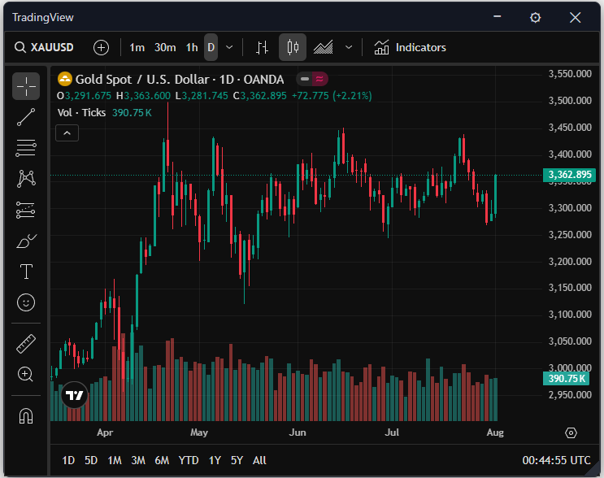

# Floating TradingView Desktop

A cross-platform desktop application for viewing cryptocurrency and stock charts in a floating window while working. Built with Electron, works on Windows, macOS, and Linux.

## Screenshot



_The floating TradingView widget in action - draggable, resizable, and always on top_

## Features

- 🚀 **Cross-platform**: Works on Windows, Mac, and Linux
- 📈 **Real-time Charts**: Direct integration with TradingView charts
- 🎯 **Always on Top**: Keep charts visible while working in other apps
- 🎨 **Customizable**: Dark/light themes, multiple chart styles
- 💾 **Persistent Settings**: Remembers your preferences and window position
- 🔄 **Auto-reload**: Smart fallback system if charts fail to load
- 🎛️ **System Tray**: Minimize to tray for easy access
- ⌨️ **Keyboard Shortcuts**: Quick access to settings and functions

## Installation & Setup

### Prerequisites
- Node.js 16+ installed on your system
- Git (optional, for cloning)

### Quick Start

1. **Clone or download** this repository:
```bash
git clone https://github.com/Akramovic1/floating-tradingview.git
cd floating-tradingview
```

2. **Install dependencies**:
```bash
npm install
```

3. **Run the application**:
```bash
npm start
```

### Building Executables

To create executable files for distribution:

**For Windows:**
```bash
npm run build-win
```

**For macOS:**
```bash
npm run build-mac
```

**For all platforms:**
```bash
npm run build-all
```

Built applications will be in the `dist/` folder.

## Usage

### Basic Operations
- **Open**: Double-click the executable or run `npm start`
- **Settings**: Click the gear icon or press `Ctrl/Cmd + ,`
- **Always on Top**: Toggle via View menu or system tray
- **Minimize**: Click minimize button or minimize to system tray
- **Close**: Click X button (minimizes to tray) or right-click tray → Quit

### Keyboard Shortcuts
- `Ctrl/Cmd + ,` - Open Settings
- `Ctrl/Cmd + R` - Reload Chart
- `Ctrl/Cmd + T` - Toggle Always on Top
- `Escape` - Close Settings Panel

### Customization
1. Click the **Settings (⚙)** button
2. Configure:
   - **Symbol**: Stock/crypto symbol (e.g., BTCUSD, AAPL, TSLA)
   - **Time Interval**: 1m, 5m, 15m, 30m, 1h, 4h, 1D, 1W, 1M
   - **Theme**: Dark or Light
   - **Chart Style**: Candles, Bars, Line, Area, etc.
3. Click **Save & Apply**

### System Tray
- **Left-click tray icon**: Show/hide window
- **Right-click tray icon**: Context menu with options
- **Balloon notification**: Shows when first minimized to tray

## Privacy & Security

This application:
- **No data collection**: Does not collect or transmit personal data
- **Local storage only**: Settings saved locally on your device
- **TradingView integration**: Uses official TradingView widgets
- **No external servers**: Direct connection to TradingView only

## Troubleshooting

### Chart Not Loading
1. **Check internet connection**
2. **Try different symbol** (e.g., AAPL, GOOGL, BTCUSD)
3. **Reload chart**: Press `Ctrl/Cmd + R`
4. **Restart application**
5. **Check firewall/antivirus** - may block TradingView connections

### Window Issues
- **Window off-screen**: Delete settings file and restart:
  - Windows: `%APPDATA%/floating-tradingview-desktop/config.json`
  - Mac: `~/Library/Application Support/floating-tradingview-desktop/config.json`
  - Linux: `~/.config/floating-tradingview-desktop/config.json`

### Performance Issues
- **Reduce window size** for better performance
- **Use lighter chart styles** (Line instead of Candles)
- **Close other applications** consuming resources

## Development

### Project Structure
```
floating-tradingview/
├── main.js          # Electron main process
├── renderer.js      # Electron preload script  
├── index.html       # Main application window
├── app.js          # Application logic
├── package.json    # Dependencies and build config
├── icons/          # Application icons
└── dist/           # Built executables (after build)
```

### Development Mode
```bash
npm run dev
```

### Building from Source
1. Install dependencies: `npm install`
2. Build for your platform: `npm run build-win` / `npm run build-mac`
3. Executable will be in `dist/` folder

## Technical Details

- **Framework**: Electron 28+
- **Renderer**: TradingView widgets with fallback system  
- **Storage**: electron-store for persistent settings
- **Security**: Context isolation enabled, node integration disabled
- **Auto-updater**: Ready for implementation

## Contributing

1. Fork the repository
2. Create feature branch: `git checkout -b feature/amazing-feature`
3. Commit changes: `git commit -m 'Add amazing feature'`
4. Push branch: `git push origin feature/amazing-feature`
5. Open Pull Request

## License

MIT License - see LICENSE file for details.

## Support

- **Issues**: Report bugs on GitHub Issues
- **Discussions**: GitHub Discussions for questions
- **TradingView**: This app uses TradingView widgets - see [TradingView](https://www.tradingview.com) for chart-related questions

---

**Enjoy trading! 📈**
