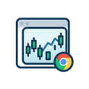

# Floating TradingView Chrome Extension

A Chrome extension that creates a floating, resizable TradingView widget that stays on top of your browser content, allowing you to monitor markets while working.

## Screenshot

_The floating TradingView widget in action - draggable, resizable, and always on top_

## Features

- 📊 **Floating Widget**: Draggable and resizable TradingView chart that floats above web content
- 💾 **Persistent Settings**: Saves position, size, and preferences across sessions
- ⌨️ **Keyboard Shortcuts**: Toggle visibility with `Ctrl+Shift+T`
- 🎨 **Customizable**: Choose symbols, intervals, themes, and chart styles
- 👻 **Opacity Control**: Adjust transparency to see content underneath
- 🔄 **Quick Toggle**: Show/hide the widget instantly
- 📱 **Minimize Function**: Collapse to header bar when not needed

## Installation

1. Download or clone this repository
2. Open Chrome and navigate to `chrome://extensions/`
3. Enable "Developer mode" in the top right
4. Click "Load unpacked" and select the extension directory
5. The extension icon will appear in your toolbar

## Usage

### Basic Controls

- **Click the extension icon** or press `Ctrl+Shift+T` to toggle the widget
- **Drag the header** to move the window
- **Drag the bottom-right corner** to resize
- **Click the minimize button (−)** to collapse the widget
- **Click the settings button (⚙)** to open configuration
- **Click the close button (✕)** to hide the widget

### Configuration Options

- **Symbol**: Enter any valid TradingView symbol (e.g., BTCUSD, AAPL, EURUSD)
- **Time Interval**: Choose from 1 minute to monthly timeframes
- **Theme**: Light or dark mode
- **Chart Style**: Candles, bars, line, area, and more
- **Opacity**: Adjust window transparency (30% to 100%)

### Popular Symbols Quick Select

Click on any symbol chip in the settings to quickly switch between:

- BTCUSD (Bitcoin/USD)
- ETHUSD (Ethereum/USD)
- EURUSD (Euro/USD)
- AAPL (Apple)
- TSLA (Tesla)
- SPY (S&P 500 ETF)

## Privacy & Permissions

This extension requires the following permissions:

- **Storage**: To save your settings and preferences
- **Active Tab**: To inject the floating widget
- **All URLs**: To work on any website

The extension does not collect or transmit any personal data.

## Troubleshooting

### Widget not appearing

- Ensure the extension is enabled in Chrome
- Try refreshing the page
- Check if the widget is minimized or hidden

### Chart not loading

- Verify you have an internet connection
- Check if the symbol is valid
- Try refreshing the widget through settings

### Position/size not saving

- Ensure you're not in incognito mode
- Check Chrome storage permissions

## Development

To modify the extension:

1. Edit the source files
2. Go to `chrome://extensions/`
3. Click the refresh icon on the extension card
4. Reload any tabs where you're using the extension

## Known Limitations

- The widget requires an internet connection to load TradingView charts
- Some websites with strict CSP policies may prevent the widget from loading
- The extension cannot function on Chrome system pages (like chrome://)

## Future Enhancements

- Multiple floating windows support
- Drawing tools integration
- Alert notifications
- Custom indicators
- Window snapping to edges
- Preset layouts
- Export/import settings

## Credits

This extension uses the [TradingView Widget](https://www.tradingview.com/widget/) for chart functionality.

## License

MIT License - feel free to modify and distribute as needed.
